========
iDRACKAR
========

:subtitle: integrated Dell Remote Access Controller's Kind Approach to the RAM
:Author: Nicolas Iooss
:date: SSTIC 2019

Introduction
~~~~~~~~~~~~

À quoi sert un BMC / iDRAC ?
============================

.. role:: latex(raw)
   :format: latex

.. figure:: draw.io_graphs/presentation-BMC-1.pdf
    :height: 70%
    :align: center

    Mise en place d'un serveur

.. raw:: latex

    \ifdefined\mynoteopened\else\mynoteouvrefichier\fi
    \immediate\write\mynotefile{\mynotedebut1}
    \immediate\write\mynotefile{- Bonjour, je m'appelle Nicolas Iooss et je suis auditeur en sécurité des systèmes d'information à l'ANSSI}
    \immediate\write\mynotefile{- Aujourd'hui je vais vous présenter le résultat des travaux que j'ai menés au sujet des iDRAC}
    \immediate\write\mynotefile{- Mais avant cela, je vais commencer par présenter un problème qui est résolu par l'utilisation d'un iDRAC, ce qui permet de mieux comprendre ce dont il s'agit.}
    \immediate\write\mynotefile{}
    \mynote{Lors de la mise en place d'un serveur dans un datacenter, un procédure peut consister en les 4 étapes suivantes : ...}

À quoi sert un BMC / iDRAC ?
============================

.. figure:: draw.io_graphs/presentation-BMC-2.pdf
    :height: 70%
    :align: center

    Installation à distance grâce au BMC

.. raw:: latex

    \mynote{Il existe depuis une vingtaine d'années des systèmes appelés BMC qui permettent d'installer un serveur à distance}
    \mynote{Cela permet de réduire le temps passer dans le datacenter}

L'iDRAC, une implémentation de BMC
==================================

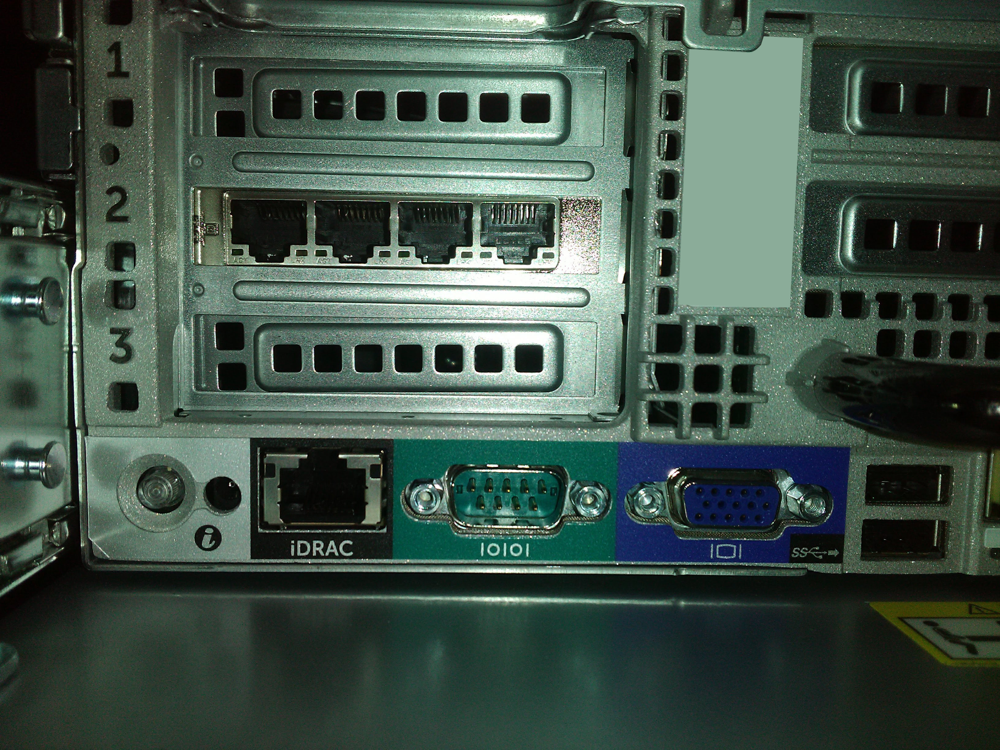

    Ports d'un serveur Dell PowerEdge R730

.. raw:: latex

    \mynote{En pratique, un BMC se présente de la manière suivante...}

Réseau avec BMC
===============

.. figure:: draw.io_graphs/presentation-BMC-3.pdf
    :width: 60%
    :align: center

    En pratique, interfaces réseau séparées

.. raw:: latex

    \mynote{À gauche : le réseau habituel sur lequel les services du serveur sont exposés}
    \mynote{À droite : le réseau des BMC, qui permet l'installation du serveur}
    \mynote{Un BMC permet aussi de superviser certaines métriques du serveur (température, alimentation...)}

Acronymes
=========

* BMC : Baseboard Management Controller
* OOB : Out-Of-Band (management)

Implémentations :

* iLO : BMC de HP
* iDRAC : BMC de Dell
* iLOM : BMC d'Oracle
* IMM : BMC de Lenovo
* AMT/ME/CSME/... : BMC d'Intel
* OpenBMC : implémentation open-source
* ...

Versions de l'iDRAC
===================

.. raw:: latex

    \iffalse
    +-------+----------+----------------------------+
    | Année | Version  | Génération de serveur Dell |
    +=======+==========+============================+
    | 1999  | DRAC II  |                            |
    +-------+----------+----------------------------+
    | 2002  | DRAC III |                            |
    +-------+----------+----------------------------+
    | 2005  | DRAC IV  | 8:sup:`e`                  |
    +-------+----------+----------------------------+
    | 2006  | DRAC 5   | 9:sup:`e`                  |
    +-------+----------+----------------------------+
    | 2008  | iDRAC 6  |                            |
    +-------+----------+----------------------------+
    | 2012  | iDRAC 7  | 12:sup:`e`                 |
    +-------+----------+----------------------------+
    | 2014  | iDRAC 8  | 13:sup:`e`                 |
    +-------+----------+----------------------------+
    | 2017  | iDRAC 9  | 14:sup:`e`                 |
    +-------+----------+----------------------------+
    \fi

    \begin{longtable}[]{@{}lll@{}}
    \toprule
    \begin{minipage}[b]{0.10\columnwidth}\raggedright
    Année\strut
    \end{minipage} & \begin{minipage}[b]{0.14\columnwidth}\raggedright
    Version\strut
    \end{minipage} & \begin{minipage}[b]{0.37\columnwidth}\raggedright
    Génération de serveur Dell\strut
    \end{minipage}\tabularnewline
    \midrule
    \endhead
    \begin{minipage}[t]{0.10\columnwidth}\raggedright
    1999\strut
    \end{minipage} & \begin{minipage}[t]{0.14\columnwidth}\raggedright
    DRAC II\strut
    \end{minipage} & \begin{minipage}[t]{0.37\columnwidth}\raggedright
    \strut
    \end{minipage}\tabularnewline
    \begin{minipage}[t]{0.10\columnwidth}\raggedright
    2002\strut
    \end{minipage} & \begin{minipage}[t]{0.14\columnwidth}\raggedright
    DRAC III\strut
    \end{minipage} & \begin{minipage}[t]{0.37\columnwidth}\raggedright
    \strut
    \end{minipage}\tabularnewline
    \begin{minipage}[t]{0.10\columnwidth}\raggedright
    2005\strut
    \end{minipage} & \begin{minipage}[t]{0.14\columnwidth}\raggedright
    DRAC IV\strut
    \end{minipage} & \begin{minipage}[t]{0.37\columnwidth}\raggedright
    8\textsuperscript{e}\strut
    \end{minipage}\tabularnewline
    \begin{minipage}[t]{0.10\columnwidth}\raggedright
    2006\strut
    \end{minipage} & \begin{minipage}[t]{0.14\columnwidth}\raggedright
    DRAC 5\strut
    \end{minipage} & \begin{minipage}[t]{0.37\columnwidth}\raggedright
    9\textsuperscript{e}\strut
    \end{minipage}\tabularnewline
    \begin{minipage}[t]{0.10\columnwidth}\raggedright
    2008\strut
    \end{minipage} & \begin{minipage}[t]{0.14\columnwidth}\raggedright
    iDRAC 6\strut
    \end{minipage} & \begin{minipage}[t]{0.37\columnwidth}\raggedright
    \strut
    \end{minipage}\tabularnewline
    \begin{minipage}[t]{0.10\columnwidth}\raggedright
    2012\strut
    \end{minipage} & \begin{minipage}[t]{0.14\columnwidth}\raggedright
    iDRAC 7\strut
    \end{minipage} & \begin{minipage}[t]{0.37\columnwidth}\raggedright
    12\textsuperscript{e}\strut
    \end{minipage}\tabularnewline
    \begin{minipage}[t]{0.10\columnwidth}\raggedright
    \only<1>{2014}\only<2>{\textbf{2014}}\strut
    \end{minipage} & \begin{minipage}[t]{0.14\columnwidth}\raggedright
    \only<1>{iDRAC 8}\only<2>{\textbf{iDRAC 8}}\strut
    \end{minipage} & \begin{minipage}[t]{0.37\columnwidth}\raggedright
    \only<1>{13\textsuperscript{e}}\only<2>{\textbf{13\textsuperscript{e}}}\strut
    \end{minipage}\tabularnewline
    \begin{minipage}[t]{0.10\columnwidth}\raggedright
    2017\strut
    \end{minipage} & \begin{minipage}[t]{0.14\columnwidth}\raggedright
    iDRAC 9\strut
    \end{minipage} & \begin{minipage}[t]{0.37\columnwidth}\raggedright
    14\textsuperscript{e}\strut
    \end{minipage}\tabularnewline
    \bottomrule
    \end{longtable}

Serveur Web embarqué
====================

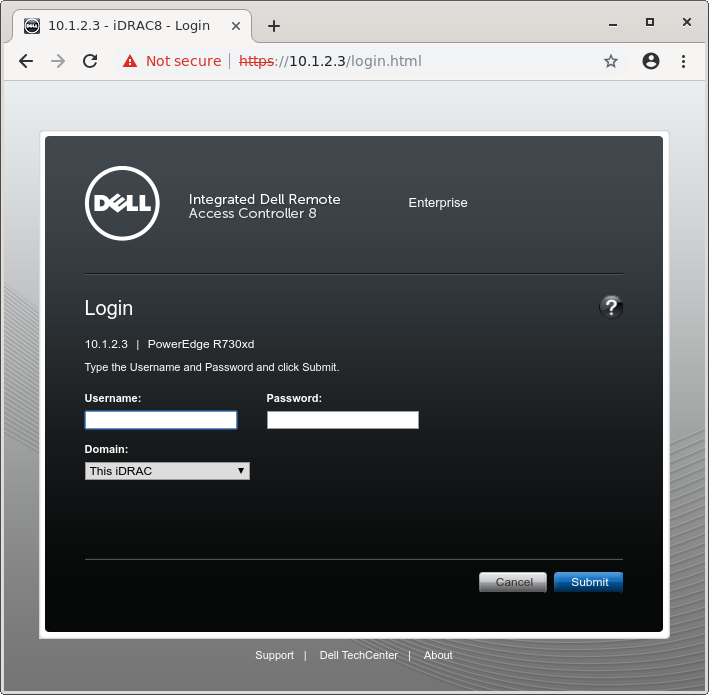

    Écran de connexion d'un iDRAC 8

Serveur Web embarqué
====================

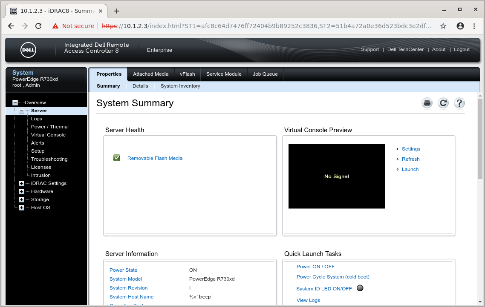

    Page Web principale de l'iDRAC 8

Vulnérabilité
=============

CVE-2018-1207 : injection de code arbitraire sur iDRAC 7 ou 8 version :math:`\leq` 2.52.52.52

* depuis le serveur Web
* avant authentification

cf. Black Hat USA 2018 : *The Unbearable Lightness of BMC's*

:latex:`\pause`

Un attaquant peut directement :

* voir le contenu de l'écran physiquement connecté ;
* utiliser le clavier/souris virtuel et le *Virtual Media* ;
* modifier la configuration du démarrage ;
* éteindre/redémarrer le serveur ;
* communiquer en utilisant l'interface réseau de l'iDRAC ;
* etc.

Position similaire à un accès physique.

Le compte manquant
==================

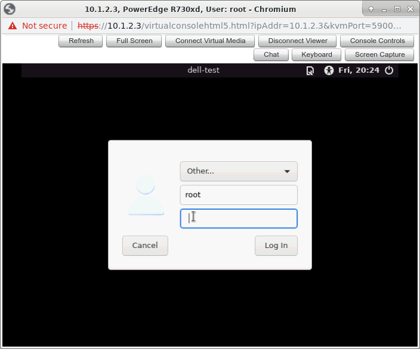

    Console déportée de l'iDRAC avec une demande d'authentification du système principal

Problématique
=============

:latex:`{\large Est-ce qu'un attaquant peut accéder au contenu de la mémoire principale ?}`

Cela permettrait :

* d'obtenir des clés de chiffrement du disque dur ;
* d'injecter du code dans le système principal ;
* d'accéder aux autres interfaces réseau du serveur ;
* etc.

Approche logicielle
~~~~~~~~~~~~~~~~~~~

Communications de l'iDRAC
=========================

.. raw:: latex

    \begin{center}
      \begin{tikzpicture}[node distance=.7cm]
        \draw ++(0, 0) node [fill,circle,shading=ball,ball color=red] (user) {}
          ++(7, 0) node [fill,circle,shading=ball,ball color=green] (idrac) {}
          ++(7, 0) node [fill,circle,shading=ball,ball color=blue] (main) {};

        \node (ui) at (3.5,0) {};
        \node (im) at (10.5,0) {};

        \node[above of=user] {Utilisateur};
        \node[above of=idrac] {iDRAC};
        \node[above of=main] {Système principal};

        \draw[thick,<->] (user.east) -- (idrac.west);
        \draw[thick,<->] (idrac.east) -- (main.west);

        \node[below of=ui, align=center] (http) {HTTPS (UI, Redfish\footnote{Interface \texttt{JSON:API} accessible sur \texttt{/redfish/v1}}, etc.)};
        \node[below of=http, align=center] (ssh) {SSH (SMASH CLP\footnote{Systems Management Architecture for Server Hardware - Command Line Protocol})};
        \node[below of=ssh, align=center] (ipminet) {IPMI/UDP};
        \node[below of=ipminet, align=center] (snmp) {SNMP};
        \node[below of=snmp, align=center] (more) {...};

        \node<2->[below of=im, align=center] (usb) {USB (clavier, souris, media)};
        \node<2->[below of=usb, align=center] (ipmismbus) {IPMI/SMBus, via \texttt{/dev/ipmi0}};

        \draw<3->[thick,->] (idrac.south) -- ++(0,-2.5) -- ++(1,0) node[anchor=west] {GPIO, SPI, etc.};
        \draw<5->[thick,dashed,->] (idrac.south) ++(0,-2.5) -- ++(0,-1) -- ++(1,0) node[anchor=west] (graphic) {Chipset graphique};
        \draw<5->[thick,dashed,->] (main.south) -- ++(0,-3.5) -- (graphic.east);
      \end{tikzpicture}
    \end{center}

    \only<4->{Et l'écran déporté ?} \only<4->{Probablement partagé}

    \only<4->{Et le PCIe ?}

Les sources
===========

Où trouver de l'information ?

* Documentation sur Internet
* Mises à jour : archives signées
* Shell obtenu par CVE-2018-1207
* Mais aussi...

Les sources ouvertes
====================

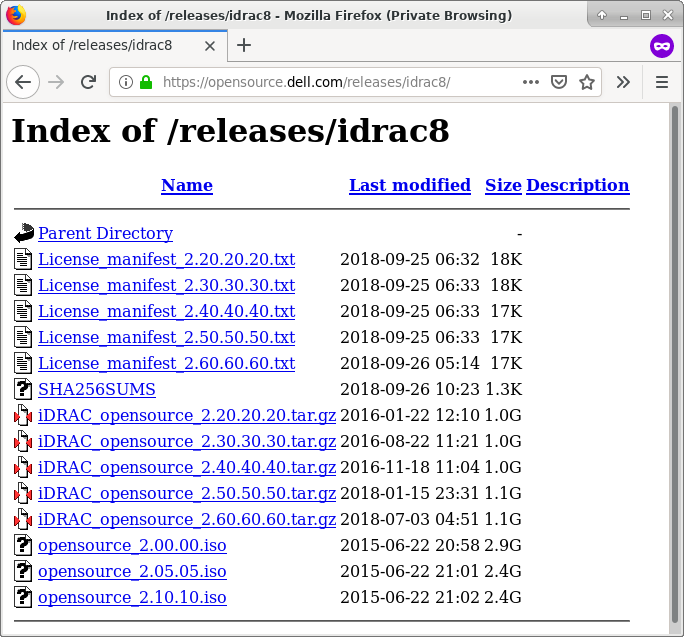

    Code source (et programmes compilés) sur https://opensource.dell.com/

Les sources ouvertes
====================

Pourquoi ?

* Distribution Linux modifiée (modules Dell sous licence GPL)
* U-Boot, OpenSSH, systemd, etc.

:latex:`\pause`

.. code-block:: text

    [SH7757 /flash/data0/home/root]$ id
    uid=0(root) gid=0(root) groups=0(root)

    [SH7757 /flash/data0/home/root]$ uname -a
    Linux MpCOZlZ 3.4.11 #1 Thu Aug 18 13:03:21 CDT 2016 sh4a GNU/Linux

    [SH7757 /flash/data0/home/root]$ cat /etc/issue
    Poky 8.0 (Yocto Project 1.3 Reference Distro) 1.3 \n \l

    [SH7757 /flash/data0/home/root]$ ls -l /sbin/init
    lrwxrwxrwx 1 root 0 20 Aug 18 2016 /sbin/init -> /lib/systemd/systemd

Qu'y a-t-il à l'intérieur du serveur ?
======================================

.. raw:: latex

    \begin{figure}
      \centering
      \begin{tikzpicture}
        \node[inner sep=0pt] (img) at (0,0) {\includegraphics[height=.70\textheight]{images/idrac-chipset.jpg}};

        % Add invisible nodes for centering
        \node at ([xshift=-4cm]img.west) {};
        \node at ([xshift=4cm]img.east) {};

        \draw<2->[thick,color=red] ([xshift=-2.4cm,yshift=0cm]img.east) rectangle ([xshift=-.6cm,yshift=-1.7cm]img.east) node[yshift=.8cm] (cpu) {};
        \draw<2->[thick,color=red,->] (cpu)
            ++(1,0) node[anchor=south west] {SH77582}
            node[anchor=north west] {(CPU SuperH4)}
            -- ++(-1,0);

        \draw<2->[thick,color=black,->] (img.west)
            ++(-1,0) node[anchor=south east] {Ethernet}
            node[anchor=north east] {<<~iDRAC~>>}
            -- ++(1,0);
      \end{tikzpicture}
      \caption{CPU de l'iDRAC 8}
    \end{figure}

Dell PowerEdge R820 system board block diagram
==============================================

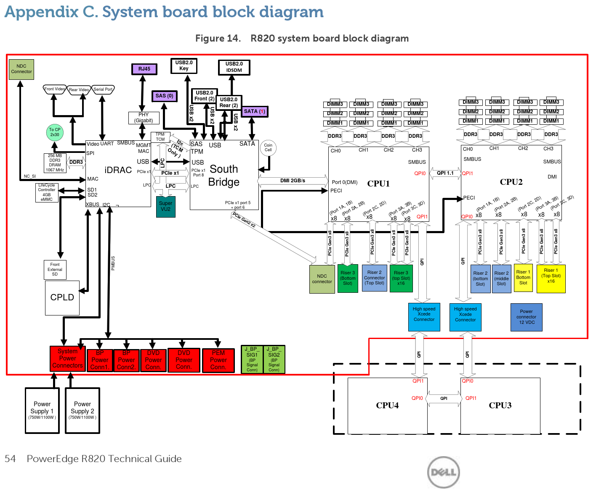

    https://www.manualslib.com/manual/624251/Dell-Poweredge-R820.html?page=54

Dell PowerEdge R820 system board block diagram
==============================================

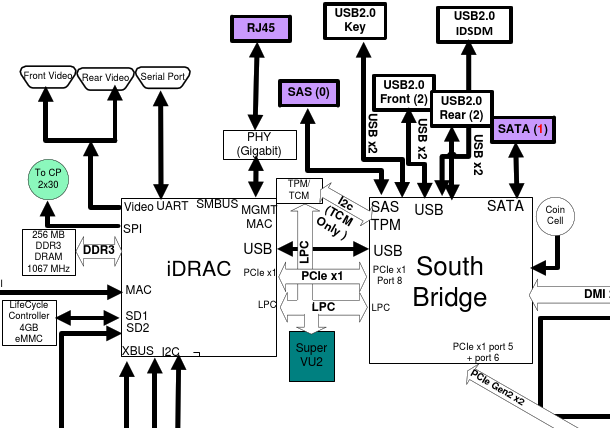

    Interfaces iDRAC-South Bridge : iDRAC en coupure de la sortie Video !

Que voit le système d'exploitation principal ?
==============================================

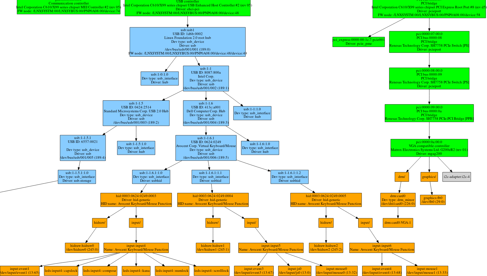

    sortie de https://github.com/fishilico/home-files/blob/master/bin/graph-hw

Que voit le système d'exploitation principal ?
==============================================

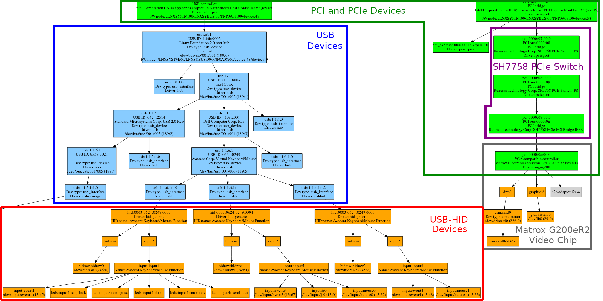

    sortie de https://github.com/fishilico/home-files/blob/master/bin/graph-hw

Arborescence PCIe
=================

BDF = Bus, Device, Function (triplet identifiant un périphérique PCI)

+-------------+-----------+-----------+---------+------------------------------+
|     BDF     | Vendor ID | Device ID | Vendor  | Device name                  |
+=============+===========+===========+=========+==============================+
| ``00:1c.7`` | ``8086``  | ``8d1e``  | Intel   | PCI Express Root Port #8     |
+-------------+-----------+-----------+---------+------------------------------+
| ``07:00.0`` | ``1912``  | ``001d``  | Renesas | SH7758 PCIe Switch [PS]      |
+-------------+-----------+-----------+---------+------------------------------+
| ``08:00.0`` | ``1912``  | ``001d``  | Renesas | SH7758 PCIe Switch [PS]      |
+-------------+-----------+-----------+---------+------------------------------+
| ``09:00.0`` | ``1912``  | ``001a``  | Renesas | SH7758 PCIe-PCI Bridge [PPB] |
+-------------+-----------+-----------+---------+------------------------------+
| ``0a:00.0`` | ``102b``  |`` 0534``  | Matrox  | G200eR2                      |
+-------------+-----------+-----------+---------+------------------------------+

::

  $ lspci -t
  +-1c.7-[07-0b]----00.0-[08-0b]----00.0-[09-0a]----00.0-[0a]----00.0

Arborescence PCIe
=================

.. raw:: latex

    \begin{center}
      \begin{tikzpicture}[node distance=.3cm]
        \node[fill,circle,shading=ball,ball color=blue] (rootport) {};
        \node[above of=rootport,anchor=south,align=center] at (rootport) {PCIe Root Port \#8 \texttt{00:1c.7} (Pri=00,Sec=07,Sub=0b)};

        \node[below of=rootport,node distance=1.5cm,fill,circle,shading=ball,ball color=blue] (dev07) {};
        \node[below of=dev07,node distance=1.5cm,fill,circle,shading=ball,ball color=blue] (dev08) {};
        \node[below of=dev08,node distance=1.4cm,fill,circle,shading=ball,ball color=blue] (dev09) {};
        \node[below of=dev09,node distance=1.4cm,fill,circle,shading=ball,ball color=blue] (graphic) {};

        \node[left of=dev07,anchor=east] {PCIe Switch \texttt{07:00.0} (07,08,0b)};
        \node[left of=dev08,anchor=east] {PCIe Switch \texttt{08:00.0} (08,09,0a)};
        \node[left of=dev09,anchor=east] {PCIe-PCI Bridge \texttt{09:00.0} (09,0a,0a)};
        \node[left of=graphic,anchor=east] {Matrox G200eR2 \texttt{0a:00.0}};

        \draw[thick,->] (rootport) -- (dev07);
        \draw[thick,->] (dev07) -- (dev08);
        \draw[thick,->] (dev08) -- (dev09);
        \draw[thick,->] (dev09) -- (graphic);

        \draw[thick,dashed] (dev08) ++(0,.7) -- ++(2,0) -- ++(0,-.7) node[fill,circle,shading=ball,ball color=blue] (ep0b) {};
        \node[right of=ep0b,anchor=west] {\texttt{0b:??.?} manquant};

        \draw[dashed,rounded corners,thick,color=red] ([xshift=-8cm,yshift=-.5cm]dev09) rectangle ([xshift=8cm,yshift=.5cm]dev07) node[anchor=north east] {iDRAC (SH7758) PCIe switch};
      \end{tikzpicture}
    \end{center}

    \mynote{Primary/Secondary/Subordinate Bus number, pour le "ID Routing" PCIe}

Communications de l'iDRAC - reprise
===================================

.. raw:: latex

    \begin{center}
      \begin{tikzpicture}[node distance=.7cm]
        \draw ++(0, 0) node [fill,circle,shading=ball,ball color=red] (user) {}
          ++(7, 0) node [fill,circle,shading=ball,ball color=green] (idrac) {}
          ++(7, 0) node [fill,circle,shading=ball,ball color=blue] (main) {};

        \node (ui) at (3.5,0) {};
        \node (im) at (10.5,0) {};

        \node[above of=user] {Utilisateur};
        \node[above of=idrac] {iDRAC};
        \node[above of=main] {Système principal};

        \draw[thick,<->] (user.east) -- (idrac.west);
        \draw[thick,<->] (idrac.east) -- (main.west);

        \node[below of=ui, align=center] (http) {HTTPS (UI, Redfish, etc.)};
        \node[below of=http, align=center] (ssh) {SSH (SMASH CLP)};
        \node[below of=ssh, align=center] (ipminet) {IPMI/UDP};
        \node[below of=ipminet, align=center] (snmp) {SNMP};
        \node[below of=snmp, align=center] (more) {...};

        \node[below of=im, align=center] (usb) {USB (clavier, souris, media)};
        \node[below of=usb, align=center] (ipmismbus) {IPMI/SMBus, via \texttt{/dev/ipmi0}};
        \node<2->[below of=ipmismbus, align=center] (pcie) {\textbf{PCIe}};

        \draw[thick,->] (idrac.south) -- ++(0,-3.5) -- ++(1,0) node[anchor=west] {GPIO, SPI, etc.};
        \draw<1>[thick,dashed,->] (idrac.south) ++(0,-3.5) -- ++(0,-1) -- ++(1,0) node[anchor=west] (graphic) {Chipset graphique};
        \draw<2->[thick,->] (idrac.south) ++(0,-3.5) -- ++(0,-1) -- ++(1,0) node[anchor=west] (graphic) {Chipset graphique};
        \draw<1>[thick,dashed,->] (main.south) -- ++(0,-4.5) -- (graphic.east);
      \end{tikzpicture}
    \end{center}

Problématique
=============

:latex:`{\large Est-ce qu'un attaquant peut accéder au contenu de la mémoire principale ?}`

:latex:`\pause`

Un attaquant peut utiliser un module *USB-Gadget* pour connecter un périphérique USB virtuel.

* utilisé pour clavier, souris, *Virtual Media* ;
* utilisé pour une interface Ethernet-USB interne::

    racadm set iDRAC.OS-BMC.AdminState Enabled

Il peut accéder au SMBus et à d'autres bus à faible débit.

Mais aussi au bus PCIe, car l'iDRAC est en coupure avec la carte graphique.

.. raw:: latex

    \begin{center}
      \large Comment ?
    \end{center}

Composants matériels spécifiques : CPLD, PBI, etc.
~~~~~~~~~~~~~~~~~~~~~~~~~~~~~~~~~~~~~~~~~~~~~~~~~~

Le CPLD
=======

* CPLD = Complex Programmable Logic Device (circuit intégré reprogrammable)
* Comme un FPGA, mais moins complexe et avec une mémoire persistante optionnelle.

Est-ce que le CPLD implémente du PCIe ?

U_CPLD à côté de U_IDRAC
========================

.. raw:: latex

    \begin{figure}
      \centering
      \begin{tikzpicture}
        \node[inner sep=0pt] (img) at (0,0) {\includegraphics[height=.70\textheight]{images/idrac-with-cpld.jpg}};

        % Add invisible nodes for centering
        \node at ([xshift=-4.5cm]img.west) {};
        \node at ([xshift=4.5cm]img.east) {};

        \draw<2->[thick,color=red] ([xshift=2cm,yshift=-.2cm]img.west) rectangle ([xshift=.3cm,yshift=-1.9cm]img.west) node[yshift=.85cm] (cpu) {};
        \draw<2->[thick,color=red,->] (cpu)
            ++(-1,0) node[anchor=south east] {SH77582}
            node[anchor=north east] {(CPU SuperH4)}
            -- ++(1,0);

        \draw<2->[thick,color=red] ([xshift=-2.2cm,yshift=-.2cm]img.east) rectangle ([xshift=-.2cm,yshift=-2.1cm]img.east) node[yshift=.95cm] (cpu) {};
        \draw<2->[thick,color=red,->] (cpu)
            ++(1,0) node[anchor=south west] {Altera MAX II}
            node[anchor=north west] {EPM2210F324C5N}
            -- ++(-1,0);
      \end{tikzpicture}
      \caption{CPLD à côté du CPU de l'iDRAC}
    \end{figure}

Utilisation du CPLD
===================

* Stockage de quelques informations::

    $ cat bin/throttle.sh
    [...]
    #---------------------------------------------------------------------------
    # Get Planer Type id
    #---------------------------------------------------------------------------
    PLANTYPE1=0x`MemAccess -rb 0x14000003|tail -n +4|head -n 1|cut -f 3 -d ' '`
    PLANTYPE2=0x`MemAccess -rb 0x14000004|tail -n +4|head -n 1|cut -f 3 -d ' '`

* GPIO pour la connexion des périphériques USB virtuels.

:math:`\Rightarrow` Pas de PCIe ``:(``

:latex:`\pause`

``MemAccess`` et ``MemAccess2`` : accès à la mémoire physique *de l'iDRAC*

Le PBI
======

Sur https://certification.ubuntu.com/

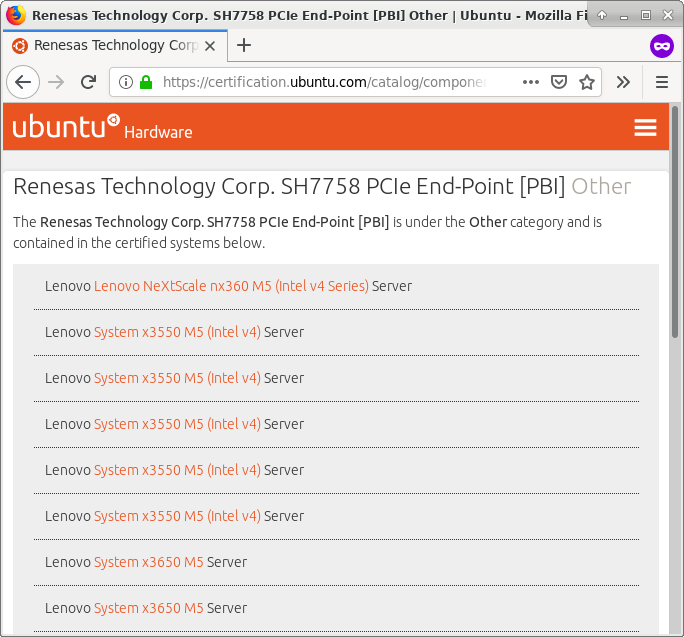

    Renesas Technology Corp. SH7758 PCIe End-Point [PBI] (``1912:001b``)

.. raw:: latex

    \mynote{Dans un serveur Lenovo, pas Dell, mais qui semble partager des composants matériel}

grep "PBI"
==========

``externalsrc/linux-drivers/pbi_driver/sh_pbi.c`` (pour ``/dev/sh_pbi``) :

.. code-block:: c

    #define PBI_MBOX_SIZE      0x1000
    #define PBI_MBOX_REGS      0xffca0000
    #define PBI_SMEM_SIZE      0x1000
    #define PBI_SMEM_START     0xffcaa000
    /* ... */
    static long
    sh_pbi_mbox_ioctl(struct file *file, unsigned int cmd, unsigned long arg)
      switch( cmd ) {
        case DELL_PBI_PRINT_CONFIG:
           // Print PCI configuration space
           printk("\n%s::%s()PCI_CONFIG\n",DRIVER_NAME,__FUNCTION__);

Commande pbitest dans l'iDRAC 8
===============================

::

    Usage: pbitest command [parameter1] [parameter2]
    ex: pbitest 1 <button> <direction> (send button message)
                  button 21=select 22=right 23=left
                  direction 0=release 1=press
    ex: pbitest 2                      (send response info message)
    ex: pbitest 3                      (send reset message)
    ex: pbitest 4                      (read message)
    ex: pbitest 5                      (poll message)
    ex: pbitest 6                      (msgin poll message)
    ex: pbitest 7 <rate> <iterations> (button stress test)
                 rate = key events per seconds, iterations is total times to run
    ex: pbitest 8                      (dumps PBI config space
                                        use dmesg to display output)
    ex: pbitest 9                      (PBI_MAILBOX_RESET)

PBI dans la RAM de l'iDRAC 8
============================

``MemAccess 0xffca0000`` + ``lspci``::

    Renesas Technology Corp. SH7758 PCIe End-Point [PBI] [1912:001b]
        Control: I/O+ Mem+ BusMaster+ SpecCycle- MemWINV- VGASnoop- ParErr-
                 Stepping- SERR- FastB2B- DisINTx-
        Status: Cap+ 66MHz- UDF- FastB2B- ParErr- DEVSEL=fast >TAbort-
                <TAbort- <MAbort- >SERR- <PERR- INTx-
        Latency: 0
        Interrupt: pin A routed to IRQ 255
        Region 0: Memory at 91901000 (32-bit, non-prefetchable)
        Region 1: Memory at 91900000 (32-bit, non-prefetchable)

Arborescence PCIe avec les adresses
===================================

.. raw:: latex

    \begin{center}
      \begin{tikzpicture}[node distance=.3cm]
        \node[fill,circle,shading=ball,ball color=blue] (rootport) {};
        \node[above of=rootport,anchor=south,align=center] at (rootport) {PCIe Root Port \#8 \texttt{00:1c.7} (Memory behind bridge: \texttt{91000000-919fffff} (10M))};

        \node[below of=rootport,node distance=1.5cm,fill,circle,shading=ball,ball color=blue] (dev07) {};
        \node[below of=dev07,node distance=1.4cm,fill,circle,shading=ball,ball color=blue] (dev08) {};
        \node[below of=dev08,node distance=1.4cm,fill,circle,shading=ball,ball color=blue] (dev09) {};
        \node[below of=dev09,node distance=1.4cm,fill,circle,shading=ball,ball color=blue] (graphic) {};

        \node[left of=dev07,anchor=south east] {PCIe Switch \texttt{07:00.0}};
        \node<2->[left of=dev07,anchor=north east] {Mem behind: \texttt{91000000-919fffff} (10M)};
        \node[left of=dev08,anchor=south east] {PCIe Switch \texttt{08:00.0}};
        \node<2->[left of=dev08,anchor=north east] {Mem behind: \texttt{91000000-918fffff} (9M)};
        \node[left of=dev09,anchor=south east] {PCIe-PCI Bridge \texttt{09:00.0}};
        \node<2->[left of=dev09,anchor=north east] {Mem behind: \texttt{91000000-918fffff} (9M)};
        \node[left of=graphic,anchor=south east] {Matrox G200eR2 \texttt{0a:00.0}};
        \node[left of=graphic,anchor=north east] {BAR1 = \texttt{91800000}, BAR2 = \texttt{91000000}};

        \draw[thick,->] (rootport) -- (dev07);
        \draw[thick,->] (dev07) -- (dev08);
        \draw[thick,->] (dev08) -- (dev09);
        \draw[thick,->] (dev09) -- (graphic);

        \draw[thick,dashed] (dev08) ++(0,.7) -- ++(1.5,0) -- ++(0,-.7) node[fill,circle,shading=ball,ball color=blue] (ep0b) {};
        \node[right of=ep0b,anchor=west] (ep0bText) {\texttt{0b:??.?} manquant\only<4->{ : \bf PBI}};
        \node<3->[below of=ep0b,node distance=6mm,anchor=west] (ep0bMem) {Mem: \texttt{91900000-919fffff} (1M)};
        \node<4->[below of=ep0b,node distance=12mm,anchor=west] {BAR0 = \texttt{91901000}, BAR1 = \texttt{91900000}};

        \draw[dashed,rounded corners,thick,color=red] ([xshift=-9cm,yshift=-.6cm]dev09) rectangle ([xshift=9cm,yshift=.6cm]dev07) node[anchor=north east] {iDRAC (SH7758) PCIe switch};
      \end{tikzpicture}
    \end{center}

    \mynote{Pour le "Address Routing" PCIe}
    \mynote{(Aussi I/O ports et prefetchable memory addresses)}

À quoi ça sert ?
================

* Le PBI est un périphérique PCIe.
* Module noyau dans l'iDRAC : mémoire partagée et *mailbox* pour recevoir des commandes.
* ``/usr/lib/libpbidrv.so.1.2.3`` : couche d'abstraction pour les programmes de l'iDRAC.
* ``/usr/include/pbidrv/lib_pbidrv.h`` : structures du PBI (``MB_MSG_HDR``, ``MB_MSG``, etc.).

:latex:`\pause`

.. code-block:: c

    // Mailbox protocol types
    #define MSG_TYPE_IPMI	0x00
    #define MSG_TYPE_CEM	0x08
    #define MSG_TYPE_LCD	0x10

    // Host to iDRAC LCD message IDs
    #define LCD_MSG_INFO    0x00
    #define LCD_MSG_COLOR   0x01
    #define LCD_MSG_TEXT    0x02
    #define LCD_MSG_BITMAP  0x03

Où est le PBI ?
===============

``externalsrc/u-boot-idrac8/u-boot_B0/board/renesas/sh7757lcr/sh7757lcr.c``

.. code-block:: c

    static void init_pcie_bridge(void)
    {
        /* ... */
        if (!(readw(PCIEBRG_CTRL_H8S) & 0x0001))
            return;
        // On 13G systems, fix issue with hiding PBI device.
        // Writing to PSPPBCTL DRS[1:0] = '01b'
        if(is_sh7758())
                writel(0x00000100, 0xffd60080);

Le PBI est caché ``:(``

Bridge PCIe ?
=============

``include/asm-sh/cpu_sh7757.h`` et ``init_pcie_bridge`` :

.. code-block:: c

    #define PCIEBRG_BASE      0xffd60000
    #define PCIEBRG_CTRL_H8S  (PCIEBRG_BASE + 0x00)
    #define PCIEBRG_CP_ADDR   (PCIEBRG_BASE + 0x10)
    #define PCIEBRG_CP_DATA   (PCIEBRG_BASE + 0x14)
    #define PCIEBRG_CP_CTRL   (PCIEBRG_BASE + 0x18)
    writew(0xa501, PCIEBRG_CTRL_H8S);   /* reset */
    writew(0x0000, PCIEBRG_CP_CTRL);
    writew(0x0000, PCIEBRG_CP_ADDR);
    for (i = 0; i < pcie_cnt; i += 2) {
        tmp = (data[i] << 8) | data[i + 1];
        writew(tmp, PCIEBRG_CP_DATA);
    }
    writew(0xa500, PCIEBRG_CTRL_H8S);   /* start */
    printf("PCIe:  Bridge loaded with 0x%x bytes\n", pcie_cnt);

Bridge PCIe
===========

Le programme de démarrage de l'iDRAC (U-Boot) envoie le microcode/*firmware* du contrôleur d'un *bridge PCIe*.

``externalsrc/u-boot-idrac8/u-boot_B0/board/renesas/sh7757lcr/bridge7758.mot`` (format Motorola S-Record).

:latex:`\pause`

::

    objcopy -I srec -O binary bridge7758.mot bridge7758.bin

Le chaînon manquant
~~~~~~~~~~~~~~~~~~~

Contenu de bridge7758.mot
=========================

* Analyse d'entropie : pas de texte, mais pas chiffré/compressé
* On retrouve les *Vendor ID* / *Device ID* PCIe des switches et bridges !
* Quelle architecture ?
* ``cpu_rec`` : non reconnue.
* Appel à un ami.

.. raw:: c

    writew(0xa501, PCIEBRG_CTRL_H8S);   /* reset */

:latex:`\pause`

C'est du H8S !

Ajout dans ``cpu_rec`` ;) https://github.com/airbus-seclab/cpu_rec/issues/4

H8S en quelques lignes
======================

* Famille H8 de Hitachi et Renesas (H8/300, H8/300H, H8/500...)
  * H8S dans certains *Embedded Controller Firmware* de batteries
  * H8/300H dans la brique LEGO:sup:`(R)` Mindstorms RCX
  * apparemment aussi dans des climatisations

* *Lenovo System x3300 M4 Type 7382 server*
  * https://systemx.lenovofiles.com/help/index.jsp?topic=%2Fcom.lenovo.sysx.7382.doc%2Fintroduction.html
  * :latex:`\guillemotleft~on-board iBMC, Renesas SH7757 (IPMI 2.0) w/ RTMM H8S-2117A for system management.~\guillemotright`

* Instructions : 2, 4, 6, 8 ou 10 octets
* Adressage sur 24 bits (16 Mo, incompatible avec le CPU *H8S* d'IDA)

H8S étudié
==========

Organisation mémoire du microcontrôleur du bridge PCIe de l'iDRAC :

* ``0x000000`` à ``0x017fff`` : microcode (96 Ko)
* ``0xffa000`` à ``0xffbfff`` : RAM (8 Ko), pile décroissant à partir de la fin
* ``0xffc000`` à ``0xffffff`` : registres matériels (MMIO)

Communication iDRAC-H8S
=======================

Au début du microcode, des vecteurs d'interruptions.

.. code-block:: c

    if (*(u8*)0xffd033 & 1) {  // Command trigger
        *(u8*)0xffd033 |= 1;
        u16 cmd = *(u16*)0xffd034;  // Retrieve command
        if (cmd <= 0x7ae) *(u16*)0xffd022 = *(u16*)(0xffc000 + cmd);
        else if (cmd == 0x800) *(u16*)0xffd022 = *(u16*)0x000004; // => 0300
        else if (cmd == 0x802) *(u16*)0xffd022 = *(u16*)0x000006; // => 0301
        else if (cmd == 0x900) *(u16*)0xffd022 = *(u16*)0xffa9be;
        else if ((cmd & 0xfff) <= 0x157) {
            u32 val = *(u32*)(0xffa000 + ((cmd>>12)-1)*0x180 + (cmd&0xffc));
            *(u16*)0xffd022 = (cmd & 2) ? (val >> 16) : (val & 0xffff);
        }
    }

Communication iDRAC-H8S
=======================

.. code-block:: sh

    # H8S ffd034 = iDRAC ffd60034
    $ MemAccess2 -ww -c 1 -a 0xffd60034 -d 0802
     MemAccess OK !

    # H8S ffd033 = iDRAC ffd60030
    $ MemAccess2 -ww -c 1 -a 0xffd60030 -d 0001
     MemAccess OK !

    # H8S ffd022 = iDRAC ffd60028
    $ MemAccess2 -rw -c 1 -a 0xffd60028
    +               0    2    4    6 :    8    A    C    E
    ------------------------------------------------------
    0xffd60028 = 0301
     MemAccess OK !

Connexions
==========

.. raw:: latex

    \begin{center}
      \begin{tikzpicture}[node distance=.3cm]
        \node[fill,circle,shading=ball,ball color=blue] (rootport) {};
        \node[above of=rootport,anchor=south,align=center] at (rootport) {PCIe Root Port \#8};

        \node[below of=rootport,node distance=1.5cm,fill,circle,shading=ball,ball color=blue] (dev07) {};
        \node[below of=dev07,node distance=1.4cm,fill,circle,shading=ball,ball color=blue] (dev08) {};
        \node[below of=dev08,node distance=1.4cm,fill,circle,shading=ball,ball color=blue] (dev09) {};
        \node[below of=dev09,node distance=1.4cm,fill,circle,shading=ball,ball color=blue] (graphic) {};

        \draw[thick,->] (rootport) -- (dev07);
        \draw[thick,->] (dev07) -- (dev08);
        \draw[thick,->] (dev08) -- (dev09);
        \draw[thick,->] (dev09) -- (graphic);

        \node[left of=dev07,anchor=east] {PCIe Switch (Upstream)};
        \node[left of=dev08,anchor=east] {PCIe Switches (Downstream)};
        \node[left of=dev09,anchor=east] {PCIe-PCI Bridge};
        \node[left of=graphic,anchor=east] {Matrox G200eR2};

        \draw[thick,dashed,->] (dev08) ++(0,.7) -- ++(1.5,0) -- ++(0,-.7) node[fill,circle,shading=ball,ball color=blue] (bridge0b) {};
        \node[below of=bridge0b,node distance=2.8cm,fill,circle,shading=ball,ball color=blue] (pbi) {};
        \draw[thick,->] (bridge0b) -- (pbi);
        \node[below of=pbi,anchor=north] {PBI};

        \node[right of=dev07,node distance=4cm,circle,shading=ball,ball color=purple,yshift=-5mm] (h8s) {};
        \node[above of=h8s,anchor=south] {MCU H8S};
        \draw[thick,purple,->] (h8s) -- (dev07);
        \draw[thick,purple,->] (h8s) -- (dev08);
        \draw[thick,purple,->] (h8s) -- (dev09);
        \draw[thick,purple,->] (h8s) -- (bridge0b);

        \node[right of=h8s,node distance=3cm,circle,shading=ball,ball color=red] (idrac) {};
        \node[right of=graphic,node distance=7cm,inner sep=0pt,fill,color=red] (idrac-bottom) {};
        \node[above of=idrac,anchor=south] {iDRAC};
        \draw[thick,red,->] (idrac) -- (h8s) node[midway,color=red,anchor=north] {\texttt{ffd600XX}};
        \draw[thick,red,->] (idrac) -- (idrac-bottom) -- (pbi);

        \node[below of=idrac-bottom,anchor=north,color=red] {\texttt{ffca0XXX} et \texttt{ffcaaXXX}};

        \draw[dashed,rounded corners,thick,color=blue] ([xshift=-6cm,yshift=-.6cm]dev09) rectangle ([xshift=5cm,yshift=.6cm]dev07);
      \end{tikzpicture}
    \end{center}

Conclusion
==========

Un attaquant qui gagne l'accès à un iDRAC peut effectuer des actions similaires à l'accès physique au serveur.

:latex:`{\large Est-ce qu'un attaquant peut accéder au contenu de la mémoire principale ?}`

* Il peut connecter un périphérique USB virtuel (clavier, interface réseau, etc.).
* Il peut reprogrammer le microcontrôleur qui pilote le bus PCIe entre la carte graphique et le système principal.
* Il est probable qu'il puisse réactiver un périphérique PCIe *PBI*.
* Il est probable qu'il puisse émettre des requêtes DMA depuis ce microcontrôleur.

:latex:`\pause`

Quoiqu'il en soit, il est recommandé de ne pas exposer un iDRAC sur Internet.

Plus de recommandations : https://www.cert.ssi.gouv.fr/actualite/CERTFR-2017-ACT-014/

.. raw:: latex

    \mynote{Bref. Si vous devez retenir 2 choses : mettez à jour vos BMC, et ne les connectez pas sur Internet}

Questions
=========

.. raw:: latex

    \begin{center}
      \Huge ?
    \end{center}

Show me the code!
=================

Bientôt le CPU H8S pour Ghidra sur https://github.com/idrackar

Commandes IPMI pour le pilotage de l'écran LCD (1/2)
====================================================

* How can I set a custom text on the LCD display on Dell PowerEdge servers?
  https://serverfault.com/questions/81015/how-can-i-set-a-custom-text-on-the-lcd-display-on-dell-poweredge-servers
* [Ipmitool-devel] Fwd: LCD access on PowerEdge 1950
  https://www.mail-archive.com/ipmitool-devel@lists.sourceforge.net/msg00352.html
* opensource.dell.com: ``ipk-dropbox/persmod/image/etc/sysapps_script/pm_lcd_update.sh``

Commandes IPMI pour le pilotage de l'écran LCD (2/2)
====================================================

.. code-block:: sh

    % ipmitool -U user -P pass -L ADMINISTRATOR raw \
    0x6 0x58 0xc1 0 0 11 0x48 0x69 0x2c 0x53 0x53 0x54 0x49 0x43 0x20 0x3b 0x29
    % ipmitool -U user -P pass -L ADMINISTRATOR raw \
    0x6 0x58 0xc2 0

Documentation:

* ``0x6`` : NetFn = Applications
* ``0x58`` : Operation = set system information
* ``0xc1/0xc2`` : set the string to this / show this string to LCD
* ``0`` : which chunk of 16 bytes is edited
* ``0`` : encoding = ANSSI
* ``11`` : length
* text (max. 14 characters according to several web pages)

iDRAC 8 vs. iDRAC 9
===================

+---------------------------+-------------+---------------------------+
|                           | iDRAC 8     | iDRAC 9                   |
+===========================+=============+===========================+
| Linux, U-Boot, etc.       | Oui         | Oui                       |
+---------------------------+-------------+---------------------------+
| Sur opensource.dell.com ? | Oui         | Oui                       |
+---------------------------+-------------+---------------------------+
| CPU                       | SuperH4     | ARM                       |
+---------------------------+-------------+---------------------------+
| SELinux ?                 | Non         | Oui                       |
+---------------------------+-------------+---------------------------+
| PBI ?                     | Oui         | Non                       |
+---------------------------+-------------+---------------------------+
| Compte initial            | root/calvin | Indiqué sur une étiquette |
+---------------------------+-------------+---------------------------+

Les CPU de Renesas
==================

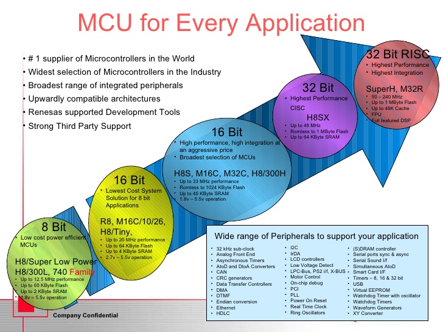

    Source : https://www.slideshare.net/Flashdomain/4-r8c-v3ppt
